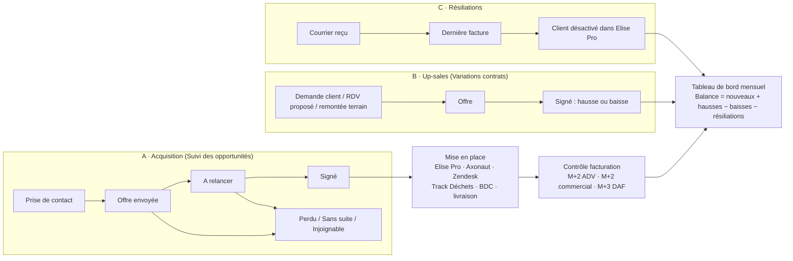

# Analyse du Google Sheet « SUIVI COMMERCIAL »

> Analyse du 04/10/2026, à partir d'une copie Excel du classeur. Ce document ne
> contient que la structure et des totaux, aucune donnée client.
> Objectif : comprendre la méthode actuelle et uniformiser la saisie entre
> prospects et clients dans Ockham CRM, en cohérence avec les champs Axonaut.

## 1. Le classeur en bref

15 onglets. Quatre portent la donnée, les autres l'analysent.

| Onglet | Lignes réelles | Rôle |
|---|---|---|
| **Suivi des opportunités** | 454 (2017 → 09/2026, dont 384 en 2025-2026) | Le pipeline : de la prise de contact à la mise en place et au contrôle |
| **Variations contrats** | 203 (139 hausses, 61 baisses) | Les hausses et baisses de CA sur des clients existants |
| **Résiliations** | 101 | Les départs de clients, avec le budget perdu et le motif |
| **Contrôle M+2 / +3** | 73 | Le contrôle de facturation après la mise en place |
| Tableau de Bord, Base Tableau Mensuel Prez, Tableau Analyse, Tableau de Bord individuel | | Les indicateurs mensuels, globaux et par commercial |
| Feuille de route 2026, Équipe commerciale 2026, Orga équipe SC, Sensibilisations, Mauvaise factu observée | | Annexes |

Les onglets de données sont mis en forme sur environ 3 000 lignes, mais seules 454, 203 et 101 sont remplies.

## 2. La méthode actuelle

### 2.1 Acquisition : le pipeline

**Étapes (colonne « Etat ») et volumes :**

| Étape | Nombre | Statut |
|---|---|---|
| Prise de contact | 23 | actif |
| Offre envoyée | 89 | actif, compte dans le pipeline en cours |
| A relancer | 18 | actif, compte dans le pipeline en cours |
| **Signé** | **167** | gagné |
| Perdu | 39 | sortie |
| Sans suite | 109 | sortie |
| Injoignable | 9 | sortie |

Le tableau considère une opportunité « active » si elle n'est ni perdue, ni sans suite, ni injoignable, et « en cours de négociation » si elle est en Offre envoyée ou A relancer.

**Qualification du lead :**

| Champ | Valeurs |
|---|---|
| Origine du lead | Elise Lyon (mail / tél), Groupe, Site internet, Prospection, AO, Audrey (apporteuse d'affaires) |
| Pourquoi Elise Lyon | Pas d'infos, Entreprise adaptée, Recommandation / partenaire, Prospection, Foisonnement (déjà client sur un autre site), Réseau, Prix, Cyclo-collecte, Vu camion / vélo |
| Chaleur | Froid, Tiède, Chaud, Bouillant |
| Décideur ? / Visite sur site | Oui / non |
| Secteur d'activité, Effectifs, Zone (1-4 ou Cyclo), Type de contrat, Privé / Public | Listes |
| Client CITEO, Client Marguerite, Sous-traitance | Oui / non |

**Valorisation :**
- budget initial (matériel + mise en place), ponctuel ;
- budget récurrent **annuel** saisi, d'où l'on déduit le mensuel (÷ 12) ;
- montant mensuel sous-traité, le cas échéant.

**Suivi :** date de relance, date de signature, contrat signé dans DocuSign, mois de première collecte, commentaires, prime du commercial (1 % du récurrent annuel).

### 2.2 Après la signature : la mise en place

Une vingtaine de colonnes servent de **check-list**, remplie pour environ 80 dossiers :

- créations dans Elise Pro : point de collecte et son **N° PdC**, client facturé et son **N° Client** ;
- tickets : CIL (livraison), CR, CAM, ODM, Zendesk ;
- dans Axonaut : champs personnalisés complets, contacts (Axonaut et Zendesk), mode de collecte ;
- Track Déchets et bon de commande : obtenu, à demander ou pas nécessaire ;
- extranet, bon de livraison ;
- exploitation : fréquence, volume maximum, CA annuel, coût par collecte, **date de mise en place** ;
- contrôle M+3 : mois de première facture, paiement effectué, notes.

### 2.3 Contrôle M+2 / M+3

Trois contrôles par client, calculés à partir de la date de mise en place :
- MEP + 60 jours, par l'ADV ;
- MEP + 62 jours, par le commercial ;
- MEP + 90 jours, par le DAF.

Le statut « A contrôler » s'affiche quand les deux premiers retours sont faits.

### 2.4 Variations de contrat : les up-sales

- **Déclencheur :** demande client (142), RDV proposé (36), remontée terrain (24), insatisfaction (1).
- **Type :** ajout de déchet (72), hausse de fréquence (34), baisse de fréquence (33), ajout de bac (25), suppression de déchet (20), retrait de bac (12).
- **Même cycle que le pipeline :** Signé, Offre envoyée, A relancer, Sans suite.
- **Montants :** budget mensuel actuel, puis nouveau budget mensuel, d'où l'**écart** (positif ou négatif), plus un budget matériel ajouté.
- **Traçabilité :** RDV saisi dans Axonaut, compte rendu envoyé, compte rendu rangé.

### 2.5 Résiliations

- **Dates :** réception du courrier, puis dernière facture, qui fixe le mois d'impact.
- **Montant :** budget récurrent annuel perdu, et mensuel (÷ 12).
- **Type de contrat :** Local, Groupe, Sous-traitance, AO.
- **Motif :**
  - liquidation ou fermeture (30) ;
  - concurrence (16) ;
  - immeuble déjà équipé (15) ;
  - non expliqué (14) ;
  - fin du tri / bacs jaunes (11) ;
  - baisse de budget (6) ;
  - plus de déchets (5) ;
  - insatisfaction ;
  - décision d'Elise Lyon.
- **Clôture :** client désactivé dans Elise Pro (oui / non).

### 2.6 Le tableau de bord mensuel

Un mois par colonne :

- **A. Acquisition**
  - nouvelles opportunités par origine et par motivation ;
  - pipeline actif : nombre, montant, panier moyen ;
  - signatures : nombre, taux de transformation (en nombre et en euros), montant annuel et mensuel, panier moyen, commande initiale, part sous-traitée ;
  - durée du cycle de vente ;
  - transformation avec ou sans visite ;
  - délai entre signature et exploitation, et part des signatures mises en exploitation ;
  - typologie : zone, secteur, CITEO, Marguerite, camion / cyclo.
- **B. Up-sales** : hausses et baisses (impact mensuel et annuel), total, RDV réalisés, répartition par déclencheur et par type.
- **C. Résiliations** : nombre, montant sur 12 mois, répartition par type de contrat et par motif.
- **Balance totale** = nouveaux + hausses − baisses − résiliations. C'est exactement le « pont » de CA récurrent prévu dans le CDC (12.2).

## 3. Les fragilités du classeur

1. **Les clés de mois sont du texte concaténé** : `MOIS & ANNÉE`, donc « 32026 » pour mars 2026. Une date vide donne « 121899 » : 291 lignes du pipeline sont dans ce cas.
2. **Des calculs sont saisis en dur dans les cellules**, par exemple `=12133.08-580.08-429` ou `=(40.93*26)/12`. On perd la trace de la fréquence et du prix unitaire.
3. **L'identité du client est ressaisie** (nom, adresse, contact) dans trois onglets, sans lien entre eux.
4. **Des contrôles « si différent de 100 % » sont nécessaires** pour repérer les lignes mal catégorisées.
5. **Les listes divergent d'un onglet à l'autre.** Le type de contrat vaut Local, National, Cadre ou AO dans le pipeline, mais Local, Groupe, Sous-traitance ou AO dans les résiliations. Elles divergent aussi avec Axonaut (voir 4).
6. **Les commerciaux sont désignés par leurs initiales** (SP, CH, MP, NR, MOB, MS, PC, ACH), alors qu'Axonaut utilise leur email.

## 4. Les champs du Sheet face aux champs personnalisés d'Axonaut

| Google Sheet | Axonaut | Alignement |
|---|---|---|
| Zone (1-4, Cyclo) | Zone + Mode de collecte | ✅ Le Sheet déduit les deux de la même colonne |
| Type de contrat | Type de contrat | ✅ Mêmes valeurs dans le pipeline, ⚠️ pas dans les résiliations |
| Privé / Public | Public/Privé | ✅ |
| Sous-traitance | Sous-traitance | ✅ |
| N° Track Déchet | Code Signature Track Déchets | ✅ |
| Bon de commande | Client soumis à BDC | ✅ |
| Secteur d'activité | Secteur client final | ⚠️ Même liste, orthographes différentes |
| Effectifs | Catégorie entreprise | ⚠️ Mêmes tranches ; Axonaut a en plus des variantes numérotées (« 2 - De 20 à 99 salariés ») |
| Origine du lead | Origine du contact | ❌ Listes différentes, et rempli à 2 % dans Axonaut |
| **N° Client / N° PdC / Code EP** | **N° Client** (= Id interne) | ✅ **Clé commune** : 95 à 100 % des codes du Sheet existent dans Axonaut |
| — | Catégorisation (1-4), Plateforme, Envoi des factures | Côté facturation uniquement |
| Chaleur, Pourquoi Elise, Décideur, Visite, CITEO, Marguerite, budgets, fréquence, volume | — | N'existent que dans le Sheet |

**La découverte clé : le code Elise Pro (N° Client / Code EP) se retrouve dans le champ « N° Client » d'Axonaut.** Dès que le commercial saisit ce code dans l'opportunité signée, la synchro Axonaut peut rattacher le client automatiquement, sans ressemblance de noms et même sans SIRET.

## 5. Ce que ça donne dans Ockham CRM

1. ~~Une seule fiche par entreprise~~ — **décidé le 04/10/2026 : fiche prospect distincte**, rattachée puis archivée dans la fiche client quand le client arrive d'Axonaut. Les champs de qualification sont des **champs personnalisés réglables** dans Ockham CRM (voir CDC 12.5).
2. **Trois types d'opportunité sur le même pipeline :**
   - **nouveau client**, qui reprend « Suivi des opportunités » ;
   - **hausse** et **baisse**, qui reprennent « Variations contrats ».
   
   Les mêmes étapes s'appliquent : Prise de contact, Offre envoyée, A relancer, Signé, avec pour sortie Perdu, Sans suite ou Injoignable. Une résiliation est un événement sur la fiche client, pas une opportunité.
3. **Des listes uniques**, réglables par l'admin et alignées sur Axonaut : secteurs, effectifs, types de contrat, origines, motivations, chaleur, déclencheurs et types de variation, motifs de résiliation. Fini les écarts d'orthographe et les contrôles « 100 % ».
4. **Le montant saisi comme on le calcule** : prix par collecte × fréquence, ou montant annuel. L'outil en déduit le mensuel. Plus de calculs en dur dans les cellules.
5. **Après « Signé », la check-list de mise en place** devient une liste de cases, chacune avec son responsable. On y saisit le **code Elise Pro**, qui déclenche le rattachement automatique au client Axonaut.
6. **Les contrôles M+2 / M+3 deviennent des tâches automatiques**, datées à partir de la mise en place et assignées à l'ADV, au commercial et au DAF.
7. **Le tableau de bord A / B / C et la balance sont calculés tout seuls**, par mois et par commercial, à partir des opportunités, des résiliations et des factures Axonaut.
8. **L'historique peut être repris** : 454 opportunités, 203 variations et 101 résiliations, importées une fois. Le tableau de bord démarre ainsi avec l'historique 2025-2026.
